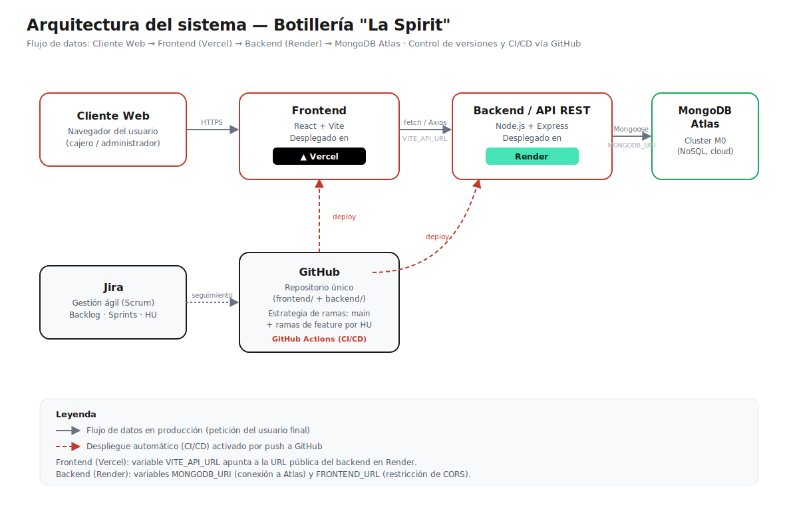

# Proyecto de Modernización: Botillería "La Spirit"

Trabajo grupal para la asignatura "Base de Datos No-Estructurados"

**Integrantes:** Jesús Bernal Moreira, Jheyson Muñoz Ugalde y Sebastián Galdames Olivares
**Fecha de entrega:** 14 de julio de 2026  
**Docente:** Francisco Prieto Rossi  
**Link Jira:** https://proyectoloscapa8.atlassian.net/jira/software/projects/SCRUM/boards/1/backlog
**Link Repositorio GitHub:** https://github.com/sebapgaldames-code/La-Spirit

## Sistema en Producción

- **Frontend (Vercel):** https://la-spirit-ra2a.vercel.app
- **Backend API (Render):** https://la-spirit-backend-ds8g.onrender.com
- **Base de datos:** MongoDB Atlas (cluster La-Spirit)

> Nota: el backend en Render (plan gratuito) puede tardar ~1 minuto en responder la primera petición si estuvo inactivo.

---

## Índice de Contenidos

- [Proyecto de Modernización: Botillería "La Spirit"](#proyecto-de-modernización-botillería-la-spirit)
  - [Sistema en Producción](#sistema-en-producción)
  - [Índice de Contenidos](#índice-de-contenidos)
  - [1. Introducción y Contexto](#1-introducción-y-contexto)
  - [2. Análisis de Necesidades del Negocio](#2-análisis-de-necesidades-del-negocio)
    - [2.1. Procesos Operativos Clave](#21-procesos-operativos-clave)
    - [2.2. Integración con Canales Digitales](#22-integración-con-canales-digitales)
  - [3. Volúmenes de Datos Actuales y Proyectados](#3-volúmenes-de-datos-actuales-y-proyectados)
    - [3.1. Datos Actuales (Basado en 20 años de operación)](#31-datos-actuales-basado-en-20-años-de-operación)
    - [3.2. Proyección de Crecimiento (3 a 5 años)](#32-proyección-de-crecimiento-3-a-5-años)
  - [4. Requisitos de Rendimiento, Escalabilidad y Disponibilidad](#4-requisitos-de-rendimiento-escalabilidad-y-disponibilidad)
    - [4.1. Rendimiento](#41-rendimiento)
    - [4.2. Escalabilidad](#42-escalabilidad)
    - [4.3. Disponibilidad](#43-disponibilidad)
  - [5. Aspectos de Seguridad y Cumplimiento Normativo](#5-aspectos-de-seguridad-y-cumplimiento-normativo)
    - [5.1. Seguridad de la Información](#51-seguridad-de-la-información)
    - [5.2. Cumplimiento Normativo](#52-cumplimiento-normativo)
  - [6. Propuesta de Arquitectura Tecnológica](#6-propuesta-de-arquitectura-tecnológica)
    - [6.1. Comparación de Alternativas de Infraestructura Cloud](#61-comparación-de-alternativas-de-infraestructura-cloud)
    - [6.2. Diagrama de Arquitectura](#62-diagrama-de-arquitectura)
  - [7. Product Backlog – Historias de Usuario y Tareas Técnicas](#7-product-backlog--historias-de-usuario-y-tareas-técnicas)
  - [8. Plan de Sprints y Distribución de Tareas (13 Días)](#8-plan-de-sprints-y-distribución-de-tareas-13-días)
    - [Equipo](#equipo)
    - [Sprint 1: Planificación, Configuración y Modelado (Días 1 - 4)](#sprint-1-planificación-configuración-y-modelado-días-1---4)
    - [Sprint 2: Desarrollo Completo del Backend y Frontend (Días 5 - 9)](#sprint-2-desarrollo-completo-del-backend-y-frontend-días-5---9)
    - [Sprint 3: Despliegue Final, Documentación y Entrega (Días 10 - 13)](#sprint-3-despliegue-final-documentación-y-entrega-días-10---13)
  - [9. Resumen de Entregables](#9-resumen-de-entregables)
  - [10. Instalación y Ejecución Local](#10-instalación-y-ejecución-local)
    - [10.1. Requisitos previos](#101-requisitos-previos)
    - [10.2. Backend](#102-backend)
    - [10.3. Frontend](#103-frontend)
    - [10.4. Documentación adicional](#104-documentación-adicional)

---

<a name="1-introducción-y-contexto"></a>

## 1. Introducción y Contexto

La botillería **“La Spirit”** opera desde hace 20 años en el mercado local, ofreciendo una amplia gama de bebidas alcohólicas y no alcohólicas, así como insumos para coctelería. Actualmente, el negocio maneja sus operaciones (stock, inventario, pedidos y punto de venta) con sistemas heredados, en su mayoría basados en hojas de cálculo y un software POS desactualizado que no se integra con el resto de los procesos. Esta situación genera:

- Desfases entre el inventario físico y el registrado.
- Dificultad para atender pedidos a domicilio y ventas por plataformas digitales.
- Pérdida de oportunidades de fidelización de clientes.
- Vulnerabilidades en la seguridad de los datos de clientes y transacciones.

El objetivo del presente documento es el desarrollo de una solución tecnológica integral que aborde las necesidades actuales y futuras del negocio, aplicando metodologías ágiles (Scrum) y utilizando tecnologías modernas como MongoDB Atlas, Node.js, React, entre otras.

A continuación, se detallan los puntos que debe considerar el equipo para la elaboración de la propuesta técnica y la posterior implementación.

---

<a name="2-análisis-de-necesidades-del-negocio"></a>
## 2. Análisis de Necesidades del Negocio

<a name="21-procesos-operativos-clave"></a>
### 2.1. Procesos Operativos Clave

1. **Gestión de Inventario y Stock**  
   - Control de existencias por producto (marca, tamaño, tipo, lote, fecha de vencimiento).  
   - Alertas automáticas de stock mínimo y productos por vencer.  
   - Registro de entradas (compras a proveedores) y salidas (ventas, mermas, devoluciones).  
   - Posibilidad de realizar inventarios cíclicos y ajustes por conteo físico.

2. **Punto de Venta (POS)**  
   - Interfaz rápida e intuitiva para cajeros, con soporte para lectores de código de barras.  
   - Cálculo automático de impuestos (IVA) y descuentos promocionales.  
   - Múltiples métodos de pago (efectivo, tarjetas, transferencias, QR).  
   - Emisión de boletas y facturas electrónicas (requisito SII en Chile).  
   - Integración con el inventario para descontar stock en tiempo real.

3. **Gestión de Pedidos**  
   - Pedidos de clientes (presenciales, por teléfono, web o app móvil).  
   - Preparación de pedidos para despacho (asignación de ruta, tiempo estimado).  
   - Historial de pedidos por cliente y seguimiento de estado.

4. **Administración de Clientes y Promociones**  
   - Base de datos de clientes con historial de compras, preferencias y datos de contacto.  
   - Programas de fidelización, cupones y descuentos personalizados.  
   - Envío de comunicaciones promocionales (email, SMS) con consentimiento del cliente.

5. **Gestión de Proveedores y Compras**  
   - Registro de proveedores, condiciones de pago y plazos de entrega.  
   - Generación automática de órdenes de compra basadas en niveles de stock.  
   - Historial de precios para negociación.

6. **Reportes y Dashboards**  
   - Ventas diarias, semanales, mensuales por categoría, marca o tipo.  
   - Productos más vendidos, rentabilidad por ítem.  
   - Análisis de tendencias estacionales (ej. aumento de ventas en fin de año).  
   - Estado financiero (caja, cuentas por cobrar, etc.).

<a name="22-integración-con-canales-digitales"></a>
### 2.2. Integración con Canales Digitales

Se requiere que el sistema pueda interoperar con:
- Tienda en línea (e-commerce) propia.
- Aplicación móvil para clientes (pedidos, historial, notificaciones).
- Sistemas contables (SII, software de contabilidad) para declaraciones tributarias.

---

<a name="3-volúmenes-de-datos-actuales-y-proyectados"></a>
## 3. Volúmenes de Datos Actuales y Proyectados

<a name="31-datos-actuales"></a>
### 3.1. Datos Actuales (Basado en 20 años de operación)

| **Entidad**              | **Volumen Estimado**             | **Observaciones** |
|--------------------------|-----------------------------------|-------------------|
| **Productos**            | ~1.500 SKUs activos              | Incluye variedades por marca, tamaño y presentación. |
| **Clientes**             | ~8.000 registros                  | Mayoría frecuentes, con datos de contacto. |
| **Transacciones (ventas)**| ~150.000 registros en los últimos 2 años | Histórico de 5 años en archivos planos. |
| **Proveedores**          | ~100 proveedores activos          | |
| **Pedidos (despachos)**  | ~20.000 registros anuales         | Crecimiento reciente por demanda de delivery. |

<a name="32-proyección-de-crecimiento"></a>
### 3.2. Proyección de Crecimiento (3 a 5 años)

Se espera un incremento anual del **15-20%** en el número de transacciones y clientes debido a:
- Expansión de la cobertura de delivery.
- Lanzamiento de tienda en línea y aplicación móvil.
- Campañas de fidelización y marketing digital.

| **Entidad**              | **Proyección a 5 años**           |
|--------------------------|-----------------------------------|
| **Productos**            | ~2.500 SKUs                       |
| **Clientes**             | ~20.000 registros                 |
| **Transacciones**        | ~500.000 registros anuales        |
| **Pedidos**              | ~100.000 anuales                  |

Estos volúmenes requieren una base de datos escalable y con capacidad de consultas rápidas, especialmente para el POS y los dashboards en tiempo real.

---

<a name="4-requisitos-de-rendimiento-escalabilidad-y-disponibilidad"></a>
## 4. Requisitos de Rendimiento, Escalabilidad y Disponibilidad

<a name="41-rendimiento"></a>
### 4.1. Rendimiento

- **Tiempo de respuesta del POS**: Menos de 1 segundo para cada operación (búsqueda de producto, aplicación de descuentos, cierre de venta).
- **Consultas de inventario**: Deben ser casi instantáneas, incluso durante horas punta (viernes y sábados por la noche).
- **Generación de reportes**: Los reportes diarios deben estar disponibles en menos de 5 segundos; los reportes históricos (mensuales/anuales) pueden tolerar hasta 30 segundos con procesamiento asíncrono.
- **Soporte para múltiples cajeros concurrentes**: Hasta 5 puntos de venta operando simultáneamente sin degradación.

<a name="42-escalabilidad"></a>
### 4.2. Escalabilidad

- **Horizontal**: Capacidad de agregar nuevos nodos de aplicación y base de datos a medida que crezca el número de transacciones y usuarios.
- **Vertical**: Soporte para incremento de datos sin necesidad de reestructurar completamente el modelo.
- **Servicios en la nube**: Se prefiere una arquitectura basada en la nube (ej. AWS, Azure, GCP) para facilitar el escalado automático bajo demanda. En este proyecto se utilizará **MongoDB Atlas** y **Render/Vercel**.

<a name="43-disponibilidad"></a>
### 4.3. Disponibilidad

- **Uptime**: 99.9% (máximo 8 horas de inactividad programada al año, y no más de 30 minutos de caída no planificada por mes).
- **Horarios críticos**: El sistema debe estar operativo durante todo el horario de atención (09:00 a 23:00, 7 días a la semana). Se aceptan ventanas de mantenimiento nocturnas (00:00 a 06:00) con previo aviso.
- **Recuperación ante desastres**: Plan de respaldo diario de la base de datos y capacidad de restauración en menos de 1 hora.

---

<a name="5-aspectos-de-seguridad-y-cumplimiento-normativo"></a>
## 5. Aspectos de Seguridad y Cumplimiento Normativo

<a name="51-seguridad-de-la-información"></a>
### 5.1. Seguridad de la Información

- **Autenticación y Autorización**: Control de acceso basado en roles (cajero, administrador de inventario, gerente, proveedor, etc.). Cada usuario debe tener credenciales únicas.
- **Cifrado**: Toda la información sensible (datos de clientes, transacciones financieras) debe estar cifrada tanto en tránsito (TLS 1.3) como en reposo (AES-256).
- **Protección de datos de pago**: Cumplimiento con PCI DSS para manejo de tarjetas de crédito/débito (se recomienda delegar el procesamiento de pagos a un gateway externo como Transbank o similar).
- **Registro de auditoría**: Trazabilidad de todas las acciones críticas (ventas, cambios de inventario, modificaciones de precios) con identificación de usuario, fecha y hora.

<a name="52-cumplimiento-normativo"></a>
### 5.2. Cumplimiento Normativo

- **GDPR (Reglamento General de Protección de Datos)**: Dado que el negocio maneja datos de clientes (nombres, direcciones, correos, historial de compras), se debe garantizar:
  - Consentimiento explícito para el tratamiento de datos personales.
  - Derecho de acceso, rectificación y cancelación (ARCO) por parte del cliente.
  - Notificación oportuna en caso de brecha de seguridad.
  - Política de retención de datos: no conservar información más allá del tiempo necesario.
- **SII (Servicio de Impuestos Internos, Chile)**: Cumplimiento con la emisión de boletas y facturas electrónicas, así como la generación de archivos para declaraciones de IVA y renta.
- **Ley 19.496 (Protección al Consumidor)**: Garantizar la correcta información de precios, promociones y condiciones de venta en todos los canales.

---

<a name="6-propuesta-de-arquitectura-tecnológica"></a>
## 6. Propuesta de Arquitectura Tecnológica

La arquitectura implementada se basa en:

- **Backend**: Node.js con Express, implementando una API RESTful.
- **Base de Datos**: MongoDB Atlas (NoSQL) para flexibilidad en el modelo de datos y su escalabilidad horizontal. Se complementará con índices apropiados para búsquedas rápidas.
- **Frontend**: React.js (Vite) para el POS y panel administrativo, con despliegue en Vercel.
- **Despliegue del Backend**: Render.
- **Control de Versiones**: GitHub, con GitHub Actions para build/CI y despliegue automático del frontend.
- **Gestión del Proyecto**: Jira (Atlassian) para la gestión Scrum.
- **Almacenamiento de Archivos**: S3 o similar para imágenes de productos y documentos (extensión futura, no implementada en el MVP).
- **Integración de Pagos**: API de Transbank Webpay Plus o similar (extensión futura, no implementada en el MVP).

<a name="61-comparación-de-alternativas-de-infraestructura-cloud"></a>
### 6.1. Comparación de Alternativas de Infraestructura Cloud

Antes de seleccionar Render y Vercel para el despliegue, se compararon las siguientes alternativas para una aplicación MERN de este tamaño:

| Plataforma | Facilidad de despliegue | Escalabilidad | Disponibilidad (free tier) | Costo | Observaciones |
|---|---|---|---|---|---|
| **Render** (backend, elegido) | Alta — detecta Node.js y despliega desde GitHub sin configuración adicional | Vertical automática en planes pagos; horizontal limitada en free tier | El servicio "duerme" tras inactividad en el plan gratuito (cold start ~1 min) | Free tier suficiente para un proyecto académico | Buen balance simplicidad/costo para un backend Express + Mongoose |
| **Vercel** (frontend, elegido) | Muy alta — integración nativa con Vite/React y despliegue en cada push | CDN global, escalado automático de assets estáticos | Alta disponibilidad incluso en free tier (no hay "sleep" para sitios estáticos) | Free tier generoso | Ideal para SPA de React; no apto para backends con estado persistente |
| **Railway** (alternativa evaluada) | Alta, similar a Render | Buena, con métricas más detalladas | Free tier con créditos limitados por mes (no ilimitado en tiempo) | Créditos gratuitos se agotan más rápido que Render | Se descartó por la limitación de créditos mensuales para uso académico prolongado |
| **AWS (EC2 / Elastic Beanstalk)** (alternativa evaluada) | Baja — requiere configurar VPC, seguridad, balanceadores manualmente | Muy alta (la más escalable de las opciones) | Alta, pero depende de la configuración manual | Requiere tarjeta de crédito y monitoreo de costos, riesgo de cobros inesperados | Se descartó por la complejidad de configuración y el riesgo de costos para un proyecto de curso |
| **Heroku** (alternativa evaluada) | Alta (similar experiencia a Render) | Buena en planes pagos | Ya no ofrece plan gratuito permanente (eliminado en 2022) | Sin free tier viable actualmente | Se descartó por no tener free tier disponible |

**Conclusión:** se optó por **Render + Vercel** porque, en conjunto, ofrecen el mejor equilibrio entre facilidad de despliegue (integración directa con GitHub), costo cero para un proyecto académico y tiempos de configuración acotados a las 4 semanas del proyecto — frente a AWS, que exige mayor curva de aprendizaje en infraestructura, y Railway/Heroku, limitados por créditos o ausencia de free tier.

<a name="62-diagrama-de-arquitectura"></a>
### 6.2. Diagrama de Arquitectura



El diagrama completo (formato SVG editable) se encuentra en [`docs/diagrama-arquitectura.svg`](docs/diagrama-arquitectura.svg). Resume el flujo:

```
Cliente Web (navegador)
        │  HTTPS
        ▼
Frontend React — desplegado en Vercel  ──(VITE_API_URL)──▶  Backend Express — desplegado en Render
                                                                     │  Mongoose (MONGODB_URI)
                                                                     ▼
                                                              MongoDB Atlas (cluster La-Spirit)

GitHub (repositorio único) ──deploy automático──▶ Vercel y Render (vía GitHub Actions / integración nativa)
Jira ──seguimiento de historias de usuario y sprints──▶ GitHub
```

---

<a name="7-product-backlog--historias-de-usuario-y-tareas-técnicas"></a>
## 7. Product Backlog – Historias de Usuario y Tareas Técnicas

| **ID** | **Historia de Usuario** | **Tareas Técnicas** | **Criterios de Aceptación** | **Prioridad** |
| :---: | :--- | :--- | :--- | :--- |
| **HU-01** | **Configuración del Proyecto y Herramientas** <br> *Yo, como equipo, quiero tener configurado el entorno de trabajo (Jira, GitHub, arquitectura) para comenzar el desarrollo.* | 1. Crear proyecto Jira (EPIC, historias, sprints, backlog).<br>2. Crear repositorios en GitHub (frontend y backend).<br>3. Definir arquitectura tecnológica (Node.js, Express, React, MongoDB Atlas, Render, Vercel).<br>4. Elaborar diagrama de arquitectura.<br>5. Redactar informe de requisitos del negocio. | - Jira creado con backlog y sprints.<br>- Repositorios en GitHub.<br>- Diagrama de arquitectura.<br>- Documento de requisitos. | Alta |
| **HU-02** | **Configuración de la Base de Datos en la Nube** <br> *Yo, como administrador, quiero tener MongoDB Atlas configurado y seguro para almacenar los datos del negocio.* | 1. Crear cuenta y cluster gratuito en MongoDB Atlas.<br>2. Configurar usuario, contraseña y red (IP 0.0.0.0/0).<br>3. Obtener cadena de conexión (URI).<br>4. Configurar variables de entorno en el backend (.env).<br>5. Documentar el proceso de configuración. | - Cluster creado y accesible.<br>- URI configurada en variables de entorno.<br>- Guía de instalación/ configuración de DBMS en la nube. | Alta |
| **HU-03** | **Desarrollo del Backend - Estructura y Modelos** <br> *Yo, como desarrollador, quiero tener la estructura del servidor Express y los modelos de datos (Producto, Cliente, Pedido, Venta) definidos.* | 1. Inicializar proyecto Node.js con Express.<br>2. Instalar dependencias (mongoose, cors, dotenv, nodemon).<br>3. Crear estructura de carpetas (src/config, /models, /controllers, /routes, /middlewares).<br>4. Configurar conexión a MongoDB Atlas (db.js).<br>5. Definir Schemas y Models: **Producto**, **Cliente**, **Pedido**, **Venta** (con validaciones y referencias).<br>6. Documentar el modelo de datos. | - Servidor Express funcionando.<br>- Conexión exitosa a MongoDB Atlas.<br>- Modelos creados con validaciones.<br>- Esquema de la base de datos documentado. | Alta |
| **HU-04** | **Desarrollo del Backend - CRUD de Productos** <br> *Yo, como bodeguero, quiero poder crear, leer, actualizar y eliminar productos para mantener el inventario actualizado.* | 1. Implementar controladores y rutas para CRUD de Productos.<br>2. Probar endpoints con Thunder Client / Postman.<br>3. Documentar el código. | - CRUD de productos funcional.<br>- Endpoints probados y documentados. | Alta |
| **HU-05** | **Desarrollo del Backend - CRUD de Clientes** <br> *Yo, como administrador, quiero gestionar la base de datos de clientes para ofrecer promociones y fidelización.* | 1. Implementar controladores y rutas para CRUD de Clientes.<br>2. Probar endpoints.<br>3. Documentar el código. | - CRUD de clientes funcional.<br>- Endpoints probados y documentados. | Alta |
| **HU-06** | **Desarrollo del Backend - CRUD de Pedidos y Ventas** <br> *Yo, como cajero, quiero registrar ventas y pedidos, y que se actualice el stock automáticamente.* | 1. Implementar controladores y rutas para CRUD de Pedidos y Ventas.<br>2. Incluir lógica para descontar stock al registrar una venta.<br>3. Implementar `populate()` para mostrar datos del cliente y productos.<br>4. Probar endpoints.<br>5. Documentar el código. | - CRUD de pedidos/ventas funcional.<br>- Actualización automática del stock.<br>- Relaciones con `populate()` funcionando. | Alta |
| **HU-07** | **Desarrollo del Backend - Consultas Avanzadas y Reportes** <br> *Yo, como gerente, quiero obtener reportes de ventas, productos más vendidos y análisis de tendencias.* | 1. Implementar consultas con `aggregate()` para:<br>   - Ventas por día/semana/mes.<br>   - Productos más vendidos.<br>   - Stock crítico (productos con bajo inventario).<br>2. Crear endpoints para reportes.<br>3. Probar y documentar. | - Reportes funcionales.<br>- Consultas con `aggregate()` implementadas y documentadas. | Media |
| **HU-08** | **Seguridad, Middlewares y CORS** <br> *Yo, como administrador, quiero que la API tenga medidas de seguridad básicas y esté preparada para ser consumida por el frontend.* | 1. Configurar middleware de errores global (`errorHandler`).<br>2. Configurar middleware para rutas no encontradas (`notFound`).<br>3. Configurar CORS para permitir solicitudes desde el frontend.<br>4. Asegurar que las variables de entorno contengan credenciales y secretos.<br>5. Documentar las medidas de seguridad implementadas. | - Manejo de errores centralizado.<br>- CORS configurado correctamente.<br>- Credenciales protegidas con variables de entorno.<br>- Documento de seguridad actualizado. | Alta |
| **HU-09** | **Despliegue del Backend en Render** <br> *Yo, como desarrollador, quiero desplegar el backend en Render para que sea accesible desde Internet.* | 1. Subir el código del backend a GitHub.<br>2. Crear cuenta en Render y conectar repositorio.<br>3. Configurar variables de entorno en Render (PORT, MONGODB_URI, FRONTEND_URL).<br>4. Realizar el deploy y obtener URL pública.<br>5. Probar endpoints en la URL pública de Render.<br>6. Documentar el despliegue. | - Backend desplegado y funcional en Render.<br>- URL pública funcional.<br>- Guía de despliegue del backend redactada. | Alta |
| **HU-10** | **Desarrollo del Frontend - Estructura y Servicios** <br> *Yo, como usuario, quiero una interfaz web amigable para gestionar el inventario, clientes, pedidos y ventas.* | 1. Inicializar proyecto React con Vite.<br>2. Instalar dependencias (axios, react-router-dom).<br>3. Configurar Axios para consumir la API del backend (usando variable de entorno VITE_API_URL).<br>4. Crear componentes reutilizables (Formulario para Productos, Clientes, Pedidos, Ventas).<br>5. Documentar la configuración del proyecto y servicios. | - Proyecto React creado.<br>- Axios configurado correctamente.<br>- Variables de entorno configuradas.<br>- Documentación del frontend. | Alta |
| **HU-11** | **Desarrollo del Frontend - POS (Punto de Venta)** <br> *Yo, como cajero, quiero una interfaz rápida para registrar ventas, buscar productos y procesar pagos.* | 1. Crear página de POS con:<br>   - Búsqueda de productos.<br>   - Carrito de compras.<br>   - Registro de cliente (opcional).<br>   - Cálculo de total e impuestos.<br>   - Botón para finalizar venta (consumir API de ventas).<br>2. Probar el flujo completo localmente. | - POS funcional.<br>- Búsqueda de productos en tiempo real.<br>- Registro de ventas exitoso. | Alta |
| **HU-12** | **Desarrollo del Frontend - Gestión de Inventario** <br> *Yo, como bodeguero, quiero ver, agregar, editar y eliminar productos desde la interfaz web.* | 1. Crear páginas de listado, creación, edición y eliminación de Productos.<br>2. Configurar rutas de React Router para estas páginas.<br>3. Probar el flujo completo. | - CRUD de productos funcional en el frontend.<br>- Navegación correcta. | Alta |
| **HU-13** | **Desarrollo del Frontend - Gestión de Clientes y Pedidos** <br> *Yo, como administrador, quiero gestionar clientes y pedidos desde la interfaz web.* | 1. Crear páginas para CRUD de Clientes.<br>2. Crear páginas para CRUD de Pedidos.<br>3. Probar el flujo completo. | - CRUD de clientes y pedidos funcional.<br>- Relaciones reflejadas en el frontend. | Media |
| **HU-14** | **Despliegue del Frontend en Vercel** <br> *Yo, como desarrollador, quiero desplegar el frontend en Vercel para que sea accesible al público.* | 1. Subir el código del frontend a GitHub.<br>2. Crear cuenta en Vercel y conectar repositorio.<br>3. Configurar variable de entorno (VITE_API_URL) con la URL del backend en Render.<br>4. Realizar el deploy y obtener URL pública.<br>5. Actualizar CORS en el backend con la URL del frontend en Vercel.<br>6. Probar la solución completa en producción.<br>7. Documentar el despliegue del frontend. | - Frontend desplegado y funcional en Vercel.<br>- Comunicación exitosa con el backend en Render.<br>- Sistema completo funcionando.<br>- Guía de despliegue redactada. | Alta |
| **HU-15** | **Documentación Final y Presentación** <br> *Yo, como equipo, quiero tener toda la documentación completa y organizada para la entrega final.* | 1. Consolidar todos los documentos (Requisitos, Arquitectura, Guías, Esquemas, etc.).<br>2. Completar el README del proyecto con instrucciones de instalación y uso.<br>3. Crear el video de 5-10 minutos demostrando el funcionamiento (opcional, pero recomendado).<br>4. Revisar y pulir la documentación para la entrega en el AAI. | - Documentación completa en el repositorio.<br>- README detallado.<br>- (Opcional) Video de demostración.<br>- Entrega final en AAI. | Alta |

---

<a name="8-plan-de-sprints-y-distribución-de-tareas-13-días"></a>
## 8. Plan de Sprints y Distribución de Tareas (13 Días)

### Equipo
- **Desarrollador A (Backend/DB)**: Enfoque en backend, base de datos y despliegue del backend.
- **Desarrollador B (Frontend)**: Enfoque en frontend y despliegue del frontend.
- **Desarrollador C (QA/Documentación)**: Enfoque en pruebas, documentación, y apoyo en lo que sea necesario.

---

<a name="sprint-1-planificación-configuración-y-modelado-días-1---4"></a>
### Sprint 1: Planificación, Configuración y Modelado (Días 1 - 4)

| **Día** | **Desarrollador A (Backend/DB)** | **Desarrollador B (Frontend)** | **Desarrollador C (QA/Documentación)** |
| :---: | :--- | :--- | :--- |
| **1** | - **HU-01**: Configurar Jira (crear proyecto, backlog, sprints).<br>- **HU-01**: Crear repositorios GitHub.<br>- **HU-02**: Crear cuenta en MongoDB Atlas y cluster. | - **HU-01**: Apoyar en la definición de arquitectura.<br>- **HU-01**: Redactar requisitos del negocio. | - **HU-01**: Documentar todo el proceso de configuración inicial.<br>- **HU-01**: Crear el diagrama de arquitectura. |
| **2** | - **HU-02**: Configurar usuario y red en Atlas.<br>- **HU-02**: Obtener URI de conexión.<br>- **HU-03**: Inicializar proyecto Node.js (Express, dotenv, etc.). | - **HU-10**: Inicializar proyecto React con Vite.<br>- **HU-10**: Instalar dependencias (axios, react-router-dom). | - **HU-03**: Configurar variables de entorno (`.env`) en backend y frontend.<br>- **HU-02**: Redactar guía de configuración de Atlas. |
| **3** | - **HU-03**: Crear `app.js`, `server.js` y conexión a MongoDB (db.js).<br>- **HU-03**: Probar conexión. | - **HU-10**: Configurar Axios (`api/axios.js`) y variables de entorno del frontend.<br>- **HU-10**: Probar petición simple al backend. | - **HU-03**: Redactar la justificación de la arquitectura tecnológica.<br>- **HU-01**: Crear el informe de requisitos del negocio. |
| **4** | - **HU-03**: Crear Schemas y Models (Producto, Cliente, Pedido, Venta).<br>- **HU-04**: Crear controladores básicos para Productos (obtener todos). | - **HU-12**: Crear componente `ProductoForm` reutilizable. | - **HU-03**: Documentar el esquema de la base de datos.<br>- **HU-04**: Apoyo en la validación de datos del Schema. |

---

<a name="sprint-2-desarrollo-completo-del-backend-y-frontend-días-5---9"></a>
### Sprint 2: Desarrollo Completo del Backend y Frontend (Días 5 - 9)

| **Día** | **Desarrollador A (Backend/DB)** | **Desarrollador B (Frontend)** | **Desarrollador C (QA/Documentación)** |
| :---: | :--- | :--- | :--- |
| **5** | - **HU-04**: Completar CRUD de Productos (GET, POST, PUT, DELETE).<br>- **HU-04**: Probar en Thunder Client. | - **HU-12**: Crear páginas de listado y creación de Productos.<br>- **HU-12**: Probar integración con el backend. | - **HU-04**: Escribir pruebas básicas con Postman/Thunder Client.<br>- Documentar progreso en Jira. |
| **6** | - **HU-05**: Crear CRUD completo de Clientes.<br>- **HU-05**: Probar en Thunder Client. | - **HU-13**: Crear páginas para CRUD de Clientes (listar, crear, editar, eliminar). | - **HU-05**: Actualizar documentación de la API (CRUD de Clientes).<br>- **HU-13**: Apoyar en pruebas de frontend. |
| **7** | - **HU-06**: Crear CRUD completo de Pedidos y Ventas (incluyendo `populate`).<br>- **HU-06**: Probar relaciones y actualización de stock. | - **HU-11**: Crear página de POS (búsqueda de productos, carrito, registro de venta). | - **HU-06**: Documentar el código de los controladores y rutas.<br>- **HU-11**: Pruebas de integración frontend-backend. |
| **8** | - **HU-07**: Implementar consultas avanzadas con `aggregate` (reportes de ventas, productos más vendidos, stock crítico).<br>- **HU-08**: Configurar middlewares (`errorHandler`, `notFound`). | - **HU-11**: Mejorar la interfaz del POS (diseño, mensajes de error, feedback).<br>- **HU-13**: Crear páginas para CRUD de Pedidos. | - **HU-07**: Escribir ejemplos de uso de la API de reportes.<br>- **HU-08**: Redactar guía de seguridad y CORS. |
| **9** | - **HU-08**: Configurar CORS y variables de entorno.<br>- **HU-09**: Subir backend a GitHub. | - **HU-14**: Subir frontend a GitHub.<br>- **HU-14**: Realizar pruebas finales de frontend local. | - **HU-09**: Crear guía de despliegue del backend.<br>- **HU-14**: Crear guía de despliegue del frontend. |

---

<a name="sprint-3-despliegue-final-documentación-y-entrega-días-10---13"></a>
### Sprint 3: Despliegue Final, Documentación y Entrega (Días 10 - 13)

| **Día** | **Desarrollador A (Backend/DB)** | **Desarrollador B (Frontend)** | **Desarrollador C (QA/Documentación)** |
| :---: | :--- | :--- | :--- |
| **10** | - **HU-09**: Desplegar backend en Render (conectar repositorio, configurar vars).<br>- Probar endpoints en producción. | - **HU-14**: Desplegar frontend en Vercel (conectar repositorio, configurar vars).<br>- Verificar que la URL del frontend apunte al backend en Render. | - **HU-09** / **HU-14**: Actualizar CORS en el backend con la URL de Vercel.<br>- Verificar funcionamiento completo en producción. |
| **11** | - **HU-14**: Verificar que el backend funcione correctamente en producción.<br>- **HU-15**: Revisar la documentación técnica del backend. | - **HU-14**: Verificar que el frontend funcione correctamente en producción.<br>- **HU-15**: Revisar la documentación del frontend. | - **HU-15**: Consolidar todos los documentos de entrega.<br>- **HU-15**: Crear el README principal del proyecto. |
| **12** | - **HU-15**: (Opcional) Grabar video demostrativo (5-10 min) mostrando el sistema completo.<br>- Realizar pruebas finales de extremo a extremo. | - **HU-15**: (Opcional) Apoyar en el video demostrativo.<br>- Realizar pruebas finales de extremo a extremo. | - **HU-15**: Asegurar que todas las tareas de Jira estén marcadas como completadas.<br>- **HU-15**: Revisar la ortografía y formato de la documentación. |
| **13** | - **Entrega Final**: Subir todos los documentos y enlaces (URLs de Render, Vercel, GitHub, Jira) a la plataforma AAI. | - **Entrega Final**: Revisar que todos los entregables estén en el repositorio. | - **Entrega Final**: Realizar la entrega formal en AAI. |

---

<a name="9-resumen-de-entregables"></a>
## 9. Resumen de Entregables

Al finalizar el proyecto, cada miembro del equipo deberá haber contribuido a los siguientes entregables:

1. **Informe de Requisitos del Negocio** (HU-01)
2. **Justificación de la Arquitectura Tecnológica** (HU-01)
3. **Guía de Configuración de MongoDB Atlas** (HU-02)
4. **Guía de Configuración del Proyecto Backend/Frontend** (HU-03, HU-10)
5. **Esquema de la Base de Datos (Modelos)** (HU-03)
6. **Guía de Seguridad y CORS** (HU-08)
7. **Guía de Despliegue en Render y Vercel** (HU-09, HU-14)
8. **Código Fuente en GitHub** (con commits de todos los miembros) (HU-09, HU-14)
9. **Proyecto Jira** (con backlog, sprints y tareas completadas) (HU-01)
10. **URL Pública del Sistema** (Frontend en Vercel, Backend en Render) (HU-14)
11. **README Técnico** (HU-15)
12. **(Opcional) Video Demostrativo** (HU-15)

---

<a name="10-instalación-y-ejecución-local"></a>
## 10. Instalación y Ejecución Local

Esta sección explica cómo clonar y ejecutar el proyecto completo (backend + frontend) en un equipo local, sin depender de Render/Vercel.

<a name="101-requisitos-previos"></a>
### 10.1. Requisitos previos

- [Node.js](https://nodejs.org/) v18 o superior y npm.
- Una cuenta y un cluster gratuito de [MongoDB Atlas](https://www.mongodb.com/atlas) (o una instancia local de MongoDB), con su cadena de conexión (URI).
- Git.

```bash
git clone https://github.com/sebapgaldames-code/La-Spirit.git
cd La-Spirit
```

<a name="102-backend"></a>
### 10.2. Backend

```bash
cd backend
npm install

# Crear el archivo de variables de entorno a partir de la plantilla
cp .env.example .env
```

Editar `.env` y completar al menos:

```
PORT=5000
MONGODB_URI=<tu cadena de conexión de MongoDB Atlas>
FRONTEND_URL=http://localhost:5173
```

Levantar el servidor en modo desarrollo (reinicio automático con nodemon):

```bash
npm run dev
```

Debería verse en consola:

```
Conectado a MongoDB
Servidor corriendo en puerto 5000
```

Verificar que responde: abrir `http://localhost:5000` en el navegador o hacer `GET http://localhost:5000/api/productos` con Thunder Client/Postman.

<a name="103-frontend"></a>
### 10.3. Frontend

En otra terminal:

```bash
cd frontend
npm install

# Crear el archivo de variables de entorno a partir de la plantilla
cp .env.example .env
```

Editar `.env` y confirmar que apunte al backend local:

```
VITE_API_URL=http://localhost:5000/api
```

Levantar el servidor de desarrollo:

```bash
npm run dev
```

Vite mostrará una URL local, típicamente `http://localhost:5173`. Abrirla en el navegador: el sistema debe cargar el Dashboard y permitir navegar entre Productos, Clientes, Pedidos, Ventas, Punto de Venta y Reportes, consumiendo datos reales desde el backend local.

Para generar el build de producción del frontend (el mismo que ejecuta Vercel):

```bash
npm run build   # genera la carpeta dist/
npm run preview # sirve ese build localmente para probarlo
```

<a name="104-documentación-adicional"></a>
### 10.4. Documentación adicional

- [`docs/diagrama-arquitectura.svg`](docs/diagrama-arquitectura.svg) — diagrama de arquitectura del sistema.
- [`docs/Despliegue_Backend_Render.md`](docs/Despliegue_Backend_Render.md) — cómo desplegar el backend en Render.
- [`docs/Despliegue_Frontend_Vercel.md`](docs/Despliegue_Frontend_Vercel.md) — cómo desplegar el frontend en Vercel.
- [`docs/Documentacion_Tecnica_Backend.md`](docs/Documentacion_Tecnica_Backend.md) — documentación técnica del backend.
- [`docs/API_Clientes.md`](docs/API_Clientes.md), [`docs/API_Productos.md`](docs/API_Productos.md), [`docs/API_Pedidos.md`](docs/API_Pedidos.md), [`docs/API_Ventas.md`](docs/API_Ventas.md), [`docs/API_Reportes.md`](docs/API_Reportes.md) — documentación de cada recurso de la API.

---